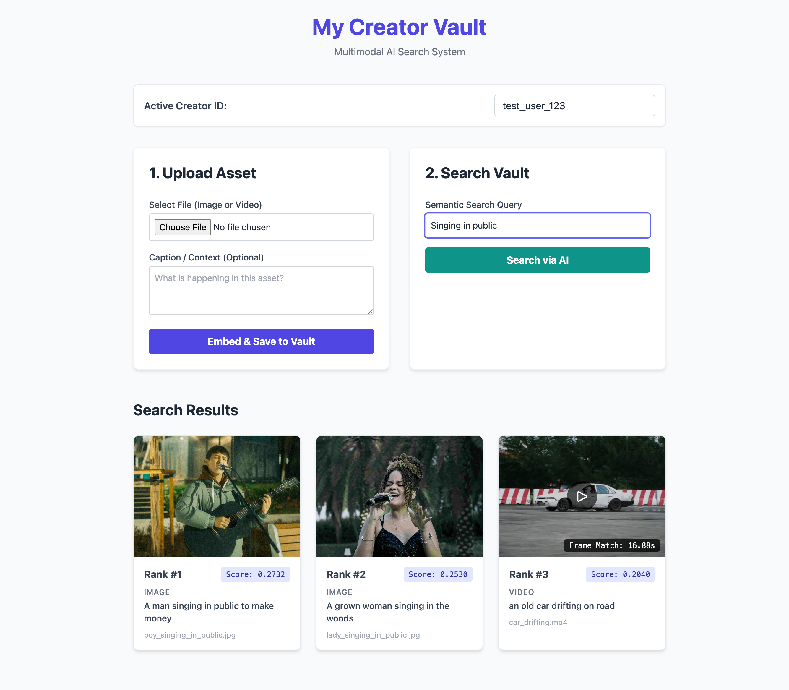

# 🌌 TensorVault

<div style="display: flex; justify-content: center; align-items: center; padding: 20px;">
  
</div>

<br />

A high-performance, multimodal semantic search engine for creators. This API allows users to upload both images and video assets, seamlessly mapping them into a shared latent space using HuggingFace's CLIP model. Users can then query their vault using natural language to retrieve the exact frame or image that matches their text description.

## ✨ Core Features

* **Multimodal Embeddings:** Utilizes `openai/clip-vit-base-patch32` to project text, images, and video frames into the same vector space.
* **Smart Video Processing:** Automatically chops uploaded videos into logical frames, embeds them, and features intelligent result deduplication to prevent a single video from flooding search results.
* **Hybrid Search Pipeline:** Performs fast dense vector retrieval via Qdrant, followed by a robust Cross-Encoder (`ms-marco-MiniLM-L-6-v2`) re-ranking stage for text candidates to ensure highest precision.
* **Headless Computer Vision:** Uses `opencv-python-headless` for lightweight, Docker-friendly video frame extraction without requiring heavy OS graphics dependencies.
* **Interactive UI:** Includes a dynamic HTML5 frontend for uploading assets, searching the vault, and previewing video frames with click-to-play timeline seeking.

## 🛠 Tech Stack

* **Backend:** FastAPI, Python 3.11+
* **Package Manager:** `uv`
* **AI/ML:** PyTorch, HuggingFace Transformers, Sentence-Transformers
* **Vector Database:** Qdrant
* **Computer Vision:** OpenCV (Headless)

---

## 💻 Local Development Setup (Using `uv`)

This project uses [Astral's `uv`](https://github.com/astral-sh/uv) for lightning-fast Python package management and virtual environment resolution.

### 1. Install `uv`
If you haven't installed `uv` yet, run:

```bash
curl -LsSf https://astral.sh/uv/install.sh | sh
```

*(For Windows, use: `powershell -c "irm https://astral.sh/uv/install.ps1 | iex"`)*

### 2. Clone the Repository & Setup Environment

Navigate to your project directory and synchronize your dependencies directly from the `pyproject.toml`:

```bash
git clone https://github.com/Now-Tiger/tensorvault.git
cd tensorvault

# Create a virtual environment and install dependencies
uv venv --python 3.11
source .venv/bin/activate
uv sync

```

### 3. Environment Variables

Create a `.env` file in the root directory and add the necessary tokens or just copy contents from `.env.example` to `.env` file and update the `.env` file with accurate values.

```bash
cp .env.example .env
```

```bash
# Required for downloading the CLIP and Cross-Encoder models
HF_TOKEN=your_huggingface_token_here

# Qdrant configuration (Defaults to local persistent storage if omitted)
QDRANT_HOST=localhost
QDRANT_PORT=6333
```

### 4. Run the API

Start the FastAPI server. The ML models will be loaded into memory during the application lifespan startup.

```bash
uv run uvicorn main:app --host 0.0.0.0 --port 8000 --reload
```

Visit `http://localhost:8000` to access the Creator Vault UI.

---

## 🐳 Running with Docker

Running the project via Docker is recommended for consistent environments. Because we are using `opencv-python-headless`, the Docker image remains lightweight and doesn't require complex X11 package installations.

Run the stack using:

```bash
docker compose up --build -d
# or
docker-compose up --build -d
```

---

## 📍 Key API Endpoints

* `GET /`: Serves the interactive frontend UI.
* `POST /upload/image/`: Ingests an image, processes its CLIP embedding, and upserts to Qdrant.
* `POST /upload/video/`: Chops video into checkpoints (1 FPS), embeds individual frames, and upserts them mapping back to the parent video.
* `GET /query/`: Accepts a semantic text `query` and `creator_id`. Returns the top-k highest matching multimedia assets, utilizing Cross-Encoder re-ranking and video frame deduplication.

## 📁 Directory Structure Note

The application dynamically creates and manages an `uploads/` directory to store physical media files and video frame snapshots. If running via Docker, ensure this directory is mounted as a volume so your media persists across container restarts.
